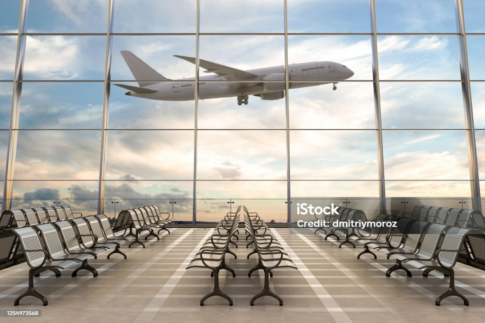
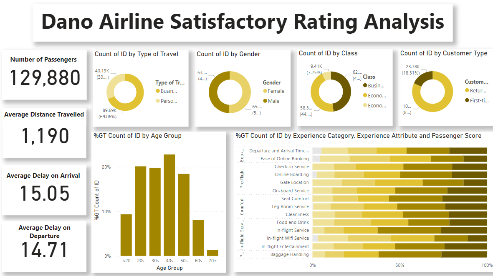

# Airline Satisfactory Analysis

## Introduction

This is a Power BI project on Dano Airlines, a UK-based airline headquartered in London, United Kingdom. The latest passenger survey results just came in and it looks like the satisfaction rate dipped under 50% for the first time ever. The leadership team needs to take action fast to find the key areas to focus on for getting back on track.

## About Dataset

Customer satisfaction scores from 120,000+ airline passengers, including additional information about each passenger, their flight, and type of travel, as well as their evaluation of different factors like cleanliness, comfort, service, and overall experience.

## Problem Statement

Recommend a data-driven strategy for increasing Dano Airlines’ satisfaction rate.

## Skills/concepts demonstrated

The following Power BI features were incorporated;
DAX, quick measures, filtering, tooltips.

## Data Source

Click [here](https://docs.google.com/spreadsheets/d/15Kp-2yfQFNRGJPNOkpMwG-OMX8xVZOJ5VL7f35v7sRQ/edit#gid=1647986900) 

## Modeling

There was no modeling since only one table was provided.

## Analysis/Visualization

In-flight wifi services, ease of booking online and gate location has a low 5 point rating compared to the other services rendered, with in-flight wifi services being the lowest. In-flight wifi services can be improved by Dano Airlines’ upgrading the satellite antenna and wifi server on all their airplanes for better network reception.

Dano Airlines’ can improve their ease of booking online by making their website easy to navigate, minimalistic and responsive thereby making it more user friendly. They should also add a live chat option to their website incase a user is having issues navigating through it and solve these problems in real time. They could also create an app for booking online and give discount rates for those using the app to promote more usage on the app.

Ratings on gate location can be improved by monitoring the amount of traffic and passengers volume on a particular airplane depending on the size of the airplane, adapting to it to reduce congestion and also reduce delay and arrival time.

